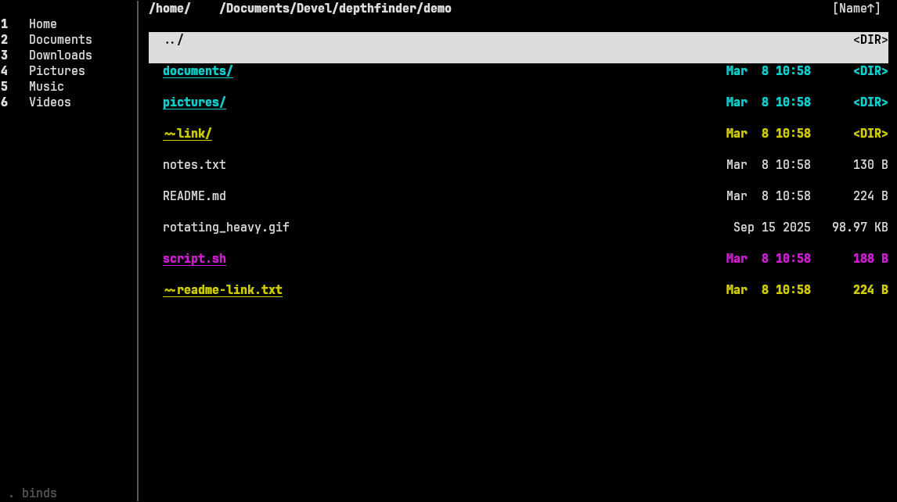
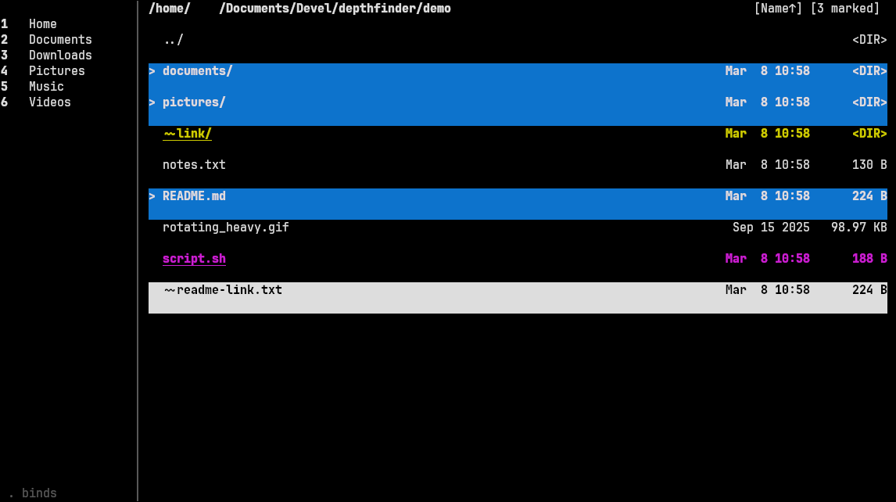
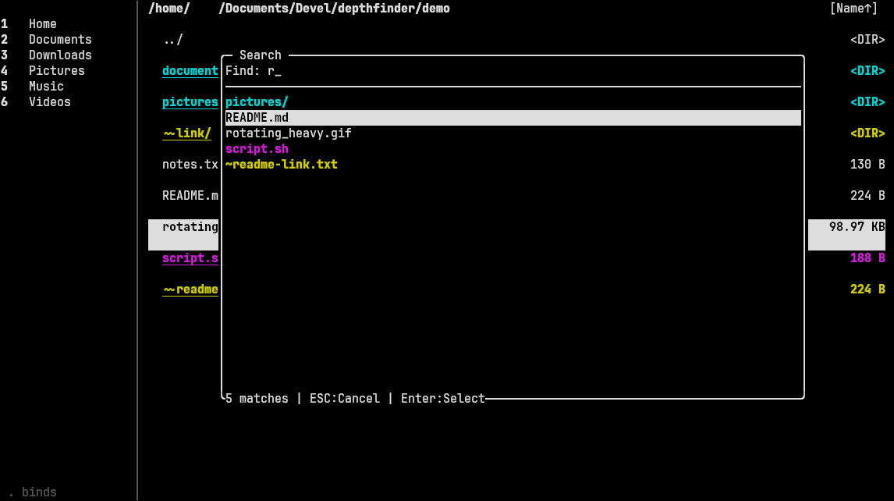
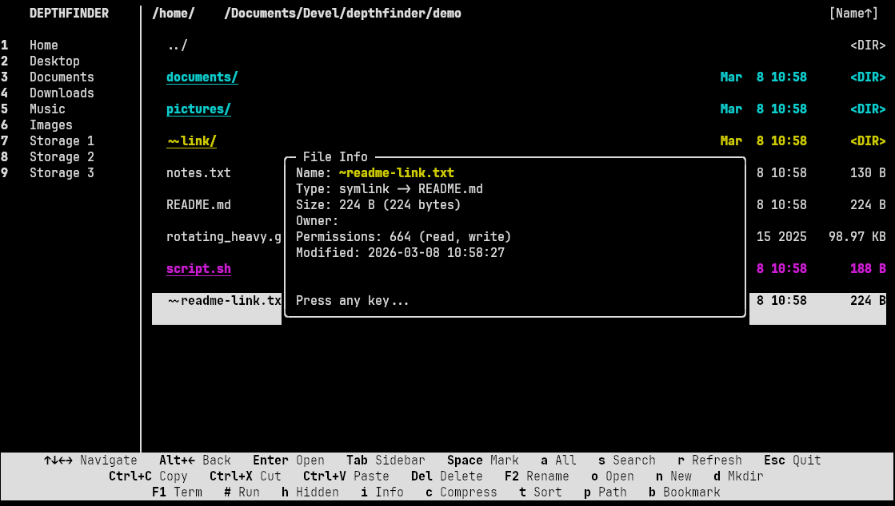
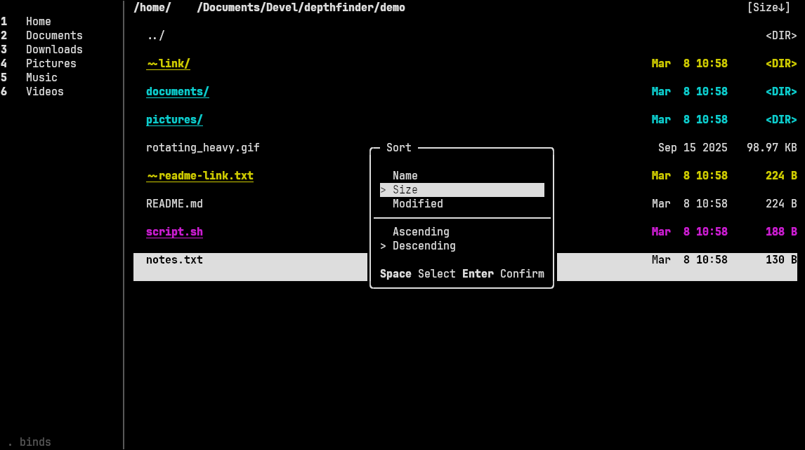

<a href="https://codeberg.org/ideumi/depthfinder/releases"></a>

# depthfinder

depthfinder (or `dfn` for short) is a:

- fast
- minimalist
- [boxflinger](https://codeberg.org/ideumi/boxflinger) based
- (mostly) zero-config
  
general-purpose **file manager** for Linux that runs in the terminal, it is written in [Chippy](https://codeberg.org/ideumi/chippy).

depthfinder is primarily meant to operate in a terminal emulator on top of an X11 or Wayland session, parallel to existing GUI tools. Though it can run solely in a tty environment or via remote `ssh`.

`dfn` has close to no external third-party dependencies (except `xdg-open`) and works entirely using boxflinger as well as the Chippy runtime and corelib.

### [Get depthfinder](#getting-depthfinder)

## Screenshots

<p align="left">
	
	
</p>

<p align="left">
	
	
</p>

<p align="left">
	
</p>

## Features

- Easy to use
- Minimalist
- Two-panel layout with sidebar bookmarks and file browser
- File operations: copy, cut, paste, delete, rename, create files and directories
	- Bulk rename
	- File conflict resolution
- Multi-select with mark/unmark and select all
- Interactive file and directory search
- Sorting
- File info dialog
- File type color coding
- Symlink-aware
- Configurable file associations
- Compress files and directories
- Run shell commands
- Bookmark management
- Dynamic window titles (for supporting terminals)

## Getting depthfinder

1. Install [Chippy](https://codeberg.org/ideumi/chippy#installation-for-supported-platforms-supported-platforms).

2. Download the latest release bundle `dfn` from the [releases page](https://codeberg.org/ideumi/depthfinder/releases) or [build](#building) one yourself.

3. Copy / install it to any preferred location, e.g. `/usr/bin/`:

```bash
sudo install -m 755 dfn /usr/bin/dfn
```

4. Run the file manager in your preferred terminal:

```bash
dfn
```

5. See [Configuration](#configuration).

## Requirements

- [Chippy](https://codeberg.org/ideumi/chippy) >= 1.0.22
- make
- git

## Building

```bash
git clone https://codeberg.org/ideumi/depthfinder
cd depthfinder
mkdir out

make
```

### Installation on FHS-Distros

```bash
sudo make install
```

### Uninstallation on FHS-Distros

```bash
sudo make uninstall
```

## Configuration

> **TLDR**; You probably want to configure your preferred terminal emulator command in `~/.dfn-terminal`.

depthfinder uses four config files, all created with defaults on first run:

- `~/.dfn-bookmarks` -- Bookmarks, one per line as `name;path` 
	- Configure this via the sidebar, not manually

- `~/.dfn-terminal` -- Terminal emulator command
	- Enter the command of your preferred terminal emulator here

- `~/.dfn-file-associations` -- File associations as `extension;command` e.g.:

```
flac;vlc
ogg;vlc
```

- `~/.dfn-lastdir` -- Last visited directory for session restore
	- This is saved automatically, no need to edit this manually

> Unconfigured file endings just run via `xdg-open`.

### Foreground Programs

Commands prefixed with `!` are run in the foreground, with direct control of the terminal. 
This works in file associations and in the "Open With" (`o`) prompt. 

Use this for TUI programs like editors:

```
txt;!vim
md;!less
```

Commands without the prefix are `Spawn(command)`'ed in the background.

## Known Issues

- Window resizing logic does not trigger when a dialog is opened, only after it is closed
	- This is intentional for now

- constants.chh: `COPYCHUNKSIZE`: works fine on my hardware, but will maybe block more when copying files on slower or different types of hardware	(e.g. HDD drives)
	- Non issue in practice but perhaps a UX thing
	- I'll maybe have the actual copying in an actor at some point so the UI refresh isn't bound to fwrite blocking

## License

depthfinder is licensed under the 2-Clause BSD License. See `LICENCE.txt`.
